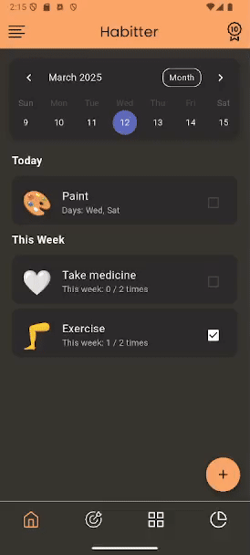

# Habitter 
Habitter is a habit tracker app built with Flutter and noSQL database Hive. It helps users track their habits, take notes, set goals and monitor progress with customizable schedules.

<p align="center">
    
    
</p>


## Features

**Manage your habits** - Create your habits and categorize them \
**Set custom schedules** - Decide how often you want to repeat certain habits\
**Take notes** - Record additional information and observations\
**Track your progress** - Mark habits as completed and view statistics 

## Usage

### Prerequisities
- Flutter
- Android Studio

### Run
1. Clone repository
    ```
    git clone git@github.com:masterofannihilation/Habitter.git 
    ```
2. Install dependencies
    ```
    flutter pub get
    ```
3. Boot your android emulator 
    ```
    flutter run
    ```

## Authors
Boris Hatala (https://github.com/masterofannihilation)
Jakub Pogádl (https://github.com/jakubp5)
Boris Semanco (https://github.com/VagosTurbo)

